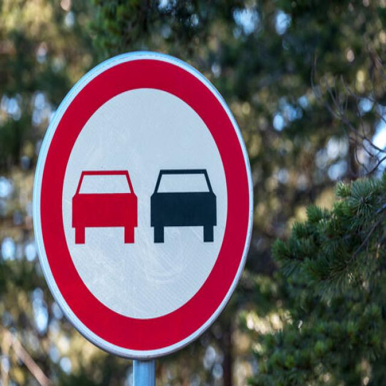
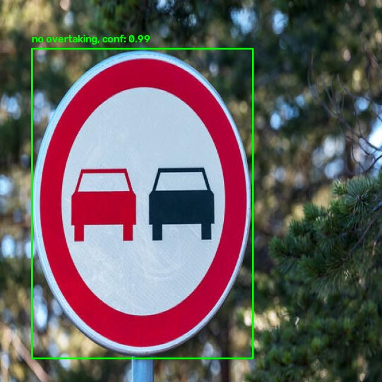
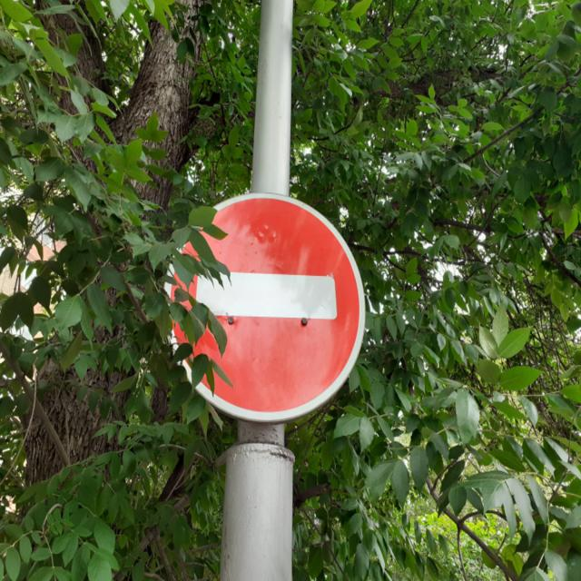

>Language: English 🇺🇸<br>

For Turkish:  [Turkish](README_tr.md)

# 💭Description
It is a Deep Learning project which includes a fine-tuned YOLOv8 model (YOLOv8n.pt) using Fully Convolutional Networks. A pre-trained YOLOv8 model is retrained with a new dataset. [🔍Traffic sign dataset](https://universe.roboflow.com/university-km5u7/traffic-sign-detection-yolov8-awuus/dataset/11) was used during the training process. The model's final version can detect traffic sign objects in an image quite accurately. Prediction samples and further details can be seen below the following headers.
## Training details
**Model:** `YOLOv8n.pt(Nano)` <br>
 **Method:** `Fine-tuning` <br>
 **Task:** `Detecting traffic signs` <br>
 **Training Epoch:** `10` <br>
 **Dataset:** [🔍Traffic sign dataset](https://universe.roboflow.com/university-km5u7/traffic-sign-detection-yolov8-awuus/dataset/11) <br>
 **Input Image Size:** `640x640` <br>
**Tech stack:** ,
 , 
,,

> [!NOTE]
> Data variation is vital for training process. A Series of augmentation process must be applied to the dataset before training. These augmentation processes was already applied in the given dataset.
# 👀Visuals
The model's accuracy was tested on two images which were not previously seen by the model. Here are the results:
| **Test Image**    | **Model's prediction**    |
|            :---:    |  :---:    |
|       |    |
|    |   |
- Conf value can be seen next to the object's label in the prediction images. It represents confidence score which was determined by the model.  
## Performance evaluation 
- The model was trained for 10 epochs and at the end of each epoch, it was tested with validation dataset. The image below illustrates the changes in the model's training and validation losses in time.

- As it is seen, the model's performance has increased progressively due to the decrease in train and validation losses.
### 🤔How this should be interpreted?
- The most critical point that needs to be checked before everything in model training is that if overfitting or underfitting has occured or not.
- What provides it is the harmony between **train/box_loss** and **val/box_loss**. In case of overfitting, while **train/box_loss** decreases, **val/box_loss** stays on the same level instead of decreasing. And when underfitting occurs, **train/box_loss** stays on the same level which means the model is not learning and the dataset is unsufficient in terms of data variaton.
- The *Precision* graph represents the model's prediction accuracy while the *Recall* graph demonstrates what percentage of instances were detected.
- *mAP50(B)* graph is the most important measurement since it evaluates the model's performance according to a strict rule that a prediction's IoU (intersection/union) value must be higher than 0.50. Also `best.pt` is selected as the weight which has the highest *mAP50* value. *mAP50-95(B)* graph evaluates the model's performance under a stricter rule that it computes the average of the model performance according to *mAP* scores 50 to 95.

# 📥Installation
- In order to install repository and libraries and to use on your local computer, follow the steps below: <br>

1-
```bash
# Clone the repo to your local computer.
git clone https://github.com/halileroglu711/YOLOv8-traffic-sign-detector.git

```
2-
```bash
# Enter to project folder
cd traffic-sign-detector
```

3-
```bash
# Install required libraries.
pip install -r requirements.txt
```

4-
```bash
# To test the model 
python test.py
```


# 📂 Project Structure 

```text
traffic-sign-detector/
│
├── assets/
│   ├── prediction-result-1.jpg
|   ├── prediction-result-2.jpg
|   ├── test1.jpg
|   └── test2.jpg
│
├── weights/
│   └── best.pt             
│
├── .gitignore              
├── README.md
└── README_tr.md            
├── requirements.txt        
├── results.png               
├── test.py             
├── train.py                

```

## ✍🏻License
- This project is licensed under the MIT License.<br>see the [LICENCE](LICENCE) for further details.


## 📬 Contact 
- Let me know if i have any mistakes. Here is where you can find me:

[](www.linkedin.com/in/halil-eroğlu-5505783a1)
[](https://github.com/halileroglu711)
[](mailto:halileroglu711@gmail.com)

